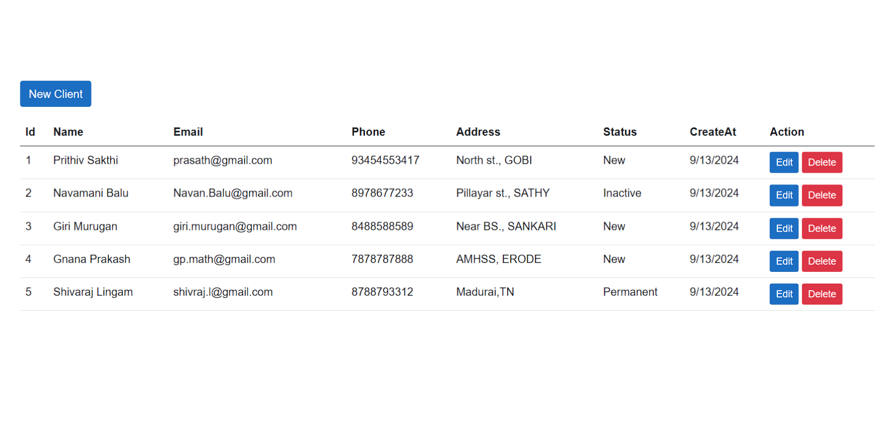

## CRUD Operation Using Blazor Web Assembly with Standalone App  - WebAPI ASP.NET - SQL Server 


Download .NET Framework [ LTS ] : https://dotnet.microsoft.com/en-us/download/dotnet-framework

 Build beautiful web apps with Blazor : https://dotnet.microsoft.com/en-us/apps/aspnet/web-apps/blazor

ASP.NET MVC Controller Overview (C#) : https://learn.microsoft.com/en-us/aspnet/mvc/overview/older-versions-1/controllers-and-routing/aspnet-mvc-controllers-overview-cs

ASP.NET Core Blazor data binding : https://learn.microsoft.com/en-us/aspnet/core/blazor/components/data-binding?view=aspnetcore-8.0&WT.mc_id=dotnet-35129-website

ASP.NET Core Blazor forms overview : https://learn.microsoft.com/en-us/aspnet/core/blazor/forms/?view=aspnetcore-8.0&WT.mc_id=dotnet-35129-website

ASP.NET Core Razor component rendering : https://learn.microsoft.com/en-us/aspnet/core/blazor/components/rendering?view=aspnetcore-8.0

Read Docs : https://learn.microsoft.com/en-us/aspnet/core/blazor/?view=aspnetcore-8.0&WT.mc_id=dotnet-35129-website


# ASP.NET Core Blazor Data Binding and Forms Overview

## Introduction

This repository demonstrates key concepts in **ASP.NET Core Blazor**, focusing on **data binding** and **forms**. You'll learn how Blazor handles data binding between Razor components and DOM elements, along with an overview of working with forms and form submission.

## Data Binding in Blazor

Blazor allows for powerful data binding features using the `@bind` directive. You can bind Razor component fields, properties, and expressions to various HTML elements.

### Example of Data Binding

In the example below, we bind an `<input>` element to both a field and a property.

```razor
@page "/bind"

<PageTitle>Bind</PageTitle>

<h1>Bind Example</h1>

<p>
    <label>
        inputValue: 
        <input @bind="inputValue" />
    </label>
</p>

<p>
    <label>
        InputValue: 
        <input @bind="InputValue" />
    </label>
</p>

<ul>
    <li><code>inputValue</code>: @inputValue</li>
    <li><code>InputValue</code>: @InputValue</li>
</ul>

@code {
    private string? inputValue;
    private string? InputValue { get; set; }
}
```

- `@bind` handles updating fields or properties when an element loses focus, allowing for real-time data reflection in the UI.
- `@bind` also composes with HTML attributes, as seen in the example below, which demonstrates manual binding using the `onchange` event.

### Manual Binding Example

```razor
@page "/bind-theory"

<PageTitle>Bind Theory</PageTitle>

<h1>Bind Theory Example</h1>

<p>
    <label>
        Normal Blazor binding: 
        <input @bind="InputValue" />
    </label>
</p>

<p>
    <label>
        Demonstration of equivalent HTML binding: 
        <input value="@InputValue"
            @onchange="@((ChangeEventArgs __e) => InputValue = __e?.Value?.ToString())" />
    </label>
</p>

<p>
    <code>InputValue</code>: @InputValue
</p>

@code {
    private string? InputValue { get; set; }
}
```

This example manually binds `InputValue` to the `onchange` event of the `<input>` element, which updates the property when the user changes focus. Blazor’s `@bind` directive handles these details automatically.

### Custom Event Binding

Blazor supports binding to specific DOM events. For example, you can use `@bind:event="input"` to trigger the binding when the `oninput` event is fired, allowing for real-time updates as the user types.

## Forms in Blazor

Blazor includes rich support for forms, making it easy to handle form submission, validation, and data binding to models.

### Form Example

```razor
@page "/starship-plain-form"
@inject ILogger<StarshipPlainForm> Logger

<form method="post" @onsubmit="Submit" @formname="starship-plain-form">
    <AntiforgeryToken />
    <div>
        <label>
            Identifier: 
            <InputText @bind-Value="Model!.Id" />
        </label>
    </div>
    <div>
        <button type="submit">Submit</button>
    </div>
</form>

@code {
    [SupplyParameterFromForm]
    private Starship? Model { get; set; }

    protected override void OnInitialized() => Model ??= new();

    private void Submit()
    {
        Logger.LogInformation("Id = {Id}", Model?.Id);
    }

    public class Starship
    {
        public string? Id { get; set; }
    }
}
```

### Key Features

- The form is submitted using a method defined in the `@onsubmit` handler.
- Data binding to form elements is done using built-in Blazor components, such as `InputText`.
- The model is passed using `[SupplyParameterFromForm]`, and any matching form data is automatically bound to the model properties.

### Best Practices

- Always use the `@formname` directive to give each form a unique name for Blazor's form processing logic.
- Use built-in components from the `Microsoft.AspNetCore.Components.Forms` namespace to handle input and validation.

### Antiforgery Support

Blazor forms support antiforgery token generation, ensuring secure form submissions.



---

For more details, refer to the official [ASP.NET Core Blazor documentation](https://docs.microsoft.com/aspnet/core/blazor).

